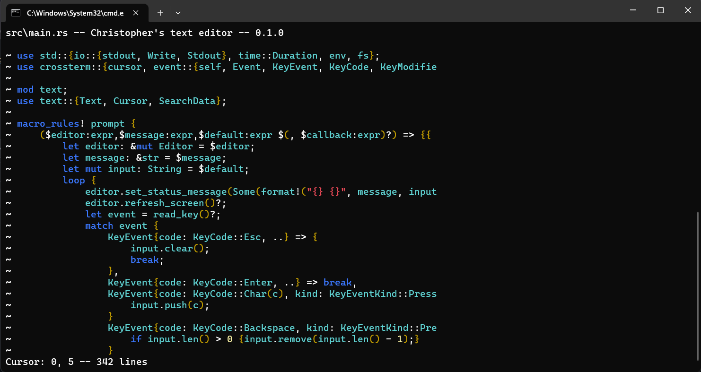

# Overview
The following is a command line text editor written entirely in Rust. It was inspired by the following [tutorial](https://medium.com/@otukof/build-your-text-editor-with-rust-678a463f968b), although with many changes. As far as I am aware, no two lines of code between my implementation and the original are the same. I even achieved a significant (27%) reduction in lines of code, whilst improving the understandability of the code.

In its current form, the program supports loading, saving, and editing files, has a search feature, and highlights Rust syntax.

## Screenshot
